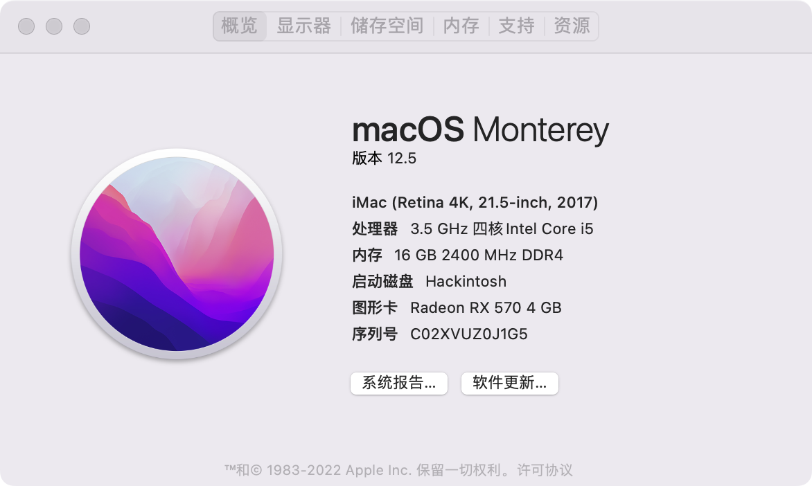
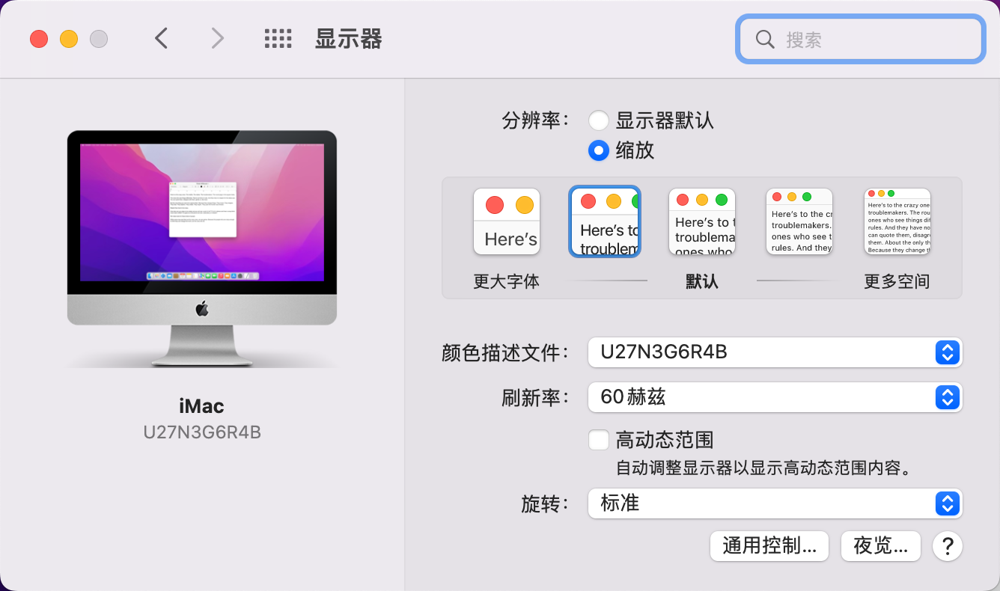

# MSI-B250M-G1-Gamer-i5-7600-EFI
> Hackintosh efi

| 配置   | 型号                           |
| ------ | ------------------------------ |
| CPU    | Intel i5 7600                  |
| 主板   | MSI B250M-G1-Gamer             |
| 显卡   | 蓝宝石RX570                    |
| 内存   | 金士顿DDR4 2400 8Gx2           |
| 网卡   | BCM94360CD 4 天线              |
| 硬盘   | Samsung SSD 970 EVO Plus 500GB |
| OC版本 | 0.8.0                          |
| macOS  | macOS Monterey 12.6            |
| 机型   | iMac18,2                       |

